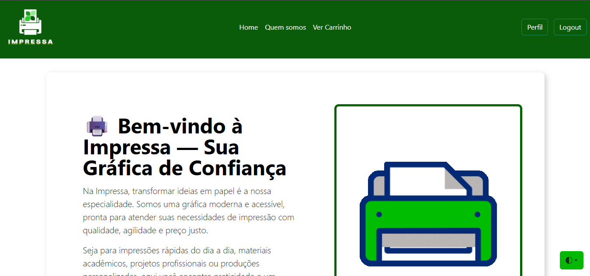
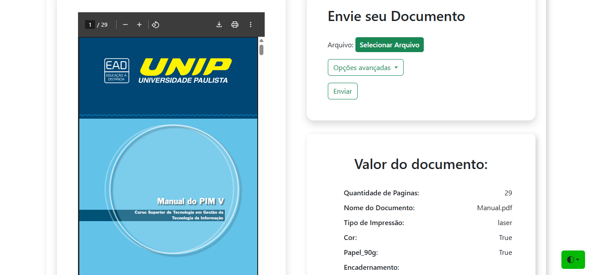
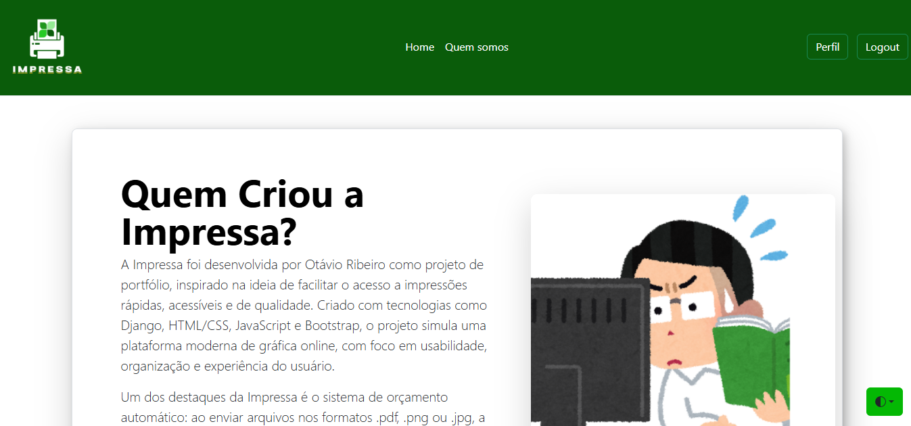
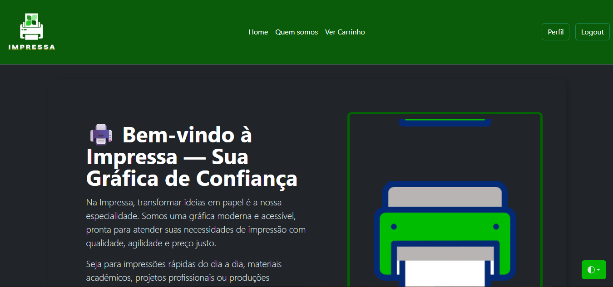
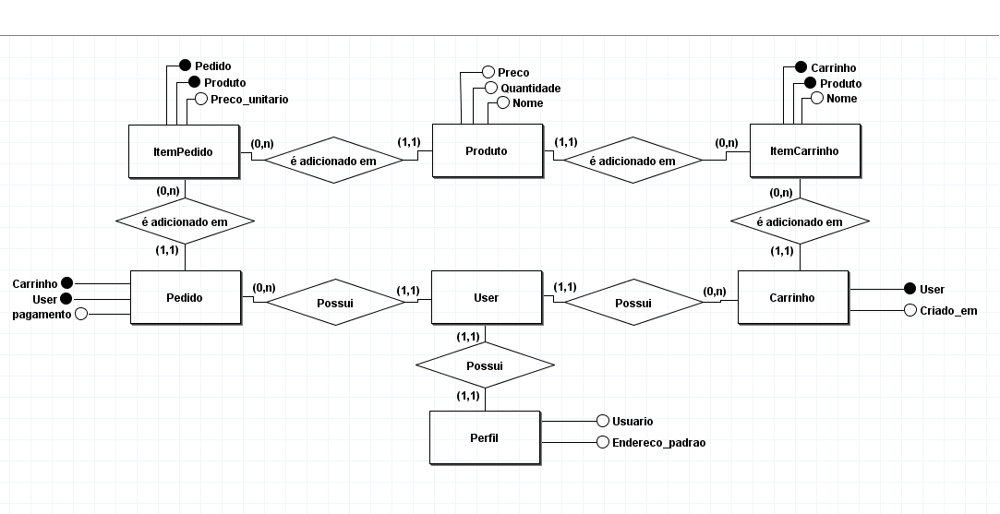

# 🖨️ Impressa

[](https://github.com/Otavio72/Impressa/blob/main/LICENSE)

**Impressa** é uma aplicação web full stack desenvolvida para facilitar o processo de orçamentos e pedidos de impressão de documentos. O projeto nasceu após minha família e eu utilizarmos serviços de terceiros e percebermos a viabilidade de termos nossa própria gráfica.

---

## 🛠️ Sobre o projeto

Impressa permite que usuários enviem documentos nos formatos **PDF**, **PNG** e **JPEG**, com orçamentos automáticos baseados na quantidade de páginas e nas configurações escolhidas.

### Funcionalidades principais:

- 🧾 Orçamentos automatizados
- 🛒 Carrinho de compras e checkout simulado
- 🔐 Sistema de login e registro de usuários
- 📚 Histórico de pedidos
- 🌙 Modo escuro
- 🧑‍💼 Painel de perfil

---

## 💻 Layout da aplicação

### Página inicial e orçamento



### Sobre o projeto e modo escuro



---

## 🗂️ Modelo conceitual



---

## 🚀 Tecnologias utilizadas

### 🔙 Back end
- Python
- Django

### 🎨 Front end
- HTML
- CSS
- JavaScript
- Bootstrap 5

---

## ⚙️ Como executar o projeto

### ✅ Pré-requisitos

- Python 3.11+
- Ambiente virtual configurado

### 📦 Instalação

```bash
# clonar repositório
git clone https://github.com/Otavio72/Impressa

Ative o ambiente virtual:
  python -m venv .venv

No Windows (PowerShell):
  ```powershell
  .venv\Scripts\Activate.ps1

No Linux/macOS:
  source .venv/bin/activate

Instale as dependências:
  pip install -r requirements.txt

Rode as migrações do banco de dados
  python manage.py migrate

python manage.py runserver

Acesse o projeto no navegador:
http://127.0.0.1:8000/
```
👤 Como acessar o sistema
Para acessar o Impressa, faça seu cadastro:
1. Acesse: http://127.0.0.1:8000/usuarios/register/
2. Preencha o formulário de cadastro
3. Após o registro, você será redirecionado para a página inicial

📁 PDFs de teste
Dentro do diretório:

```makefile
Impressa/Pfds_para_teste
```
Você encontrará alguns pdfs para teste da aplicação.


# Autor
Otávio Ribeiro
[🔗LinkedIn](https://www.linkedin.com/in/otávio-ribeiro-57a359197)
